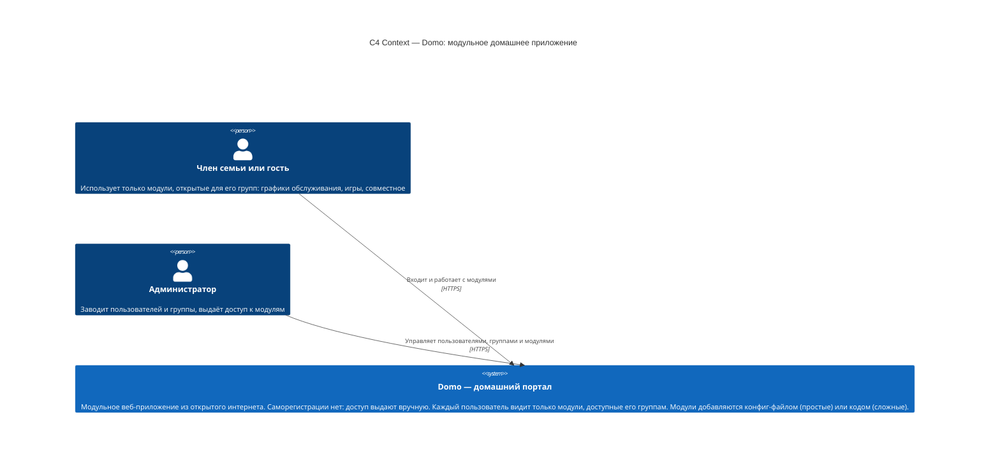
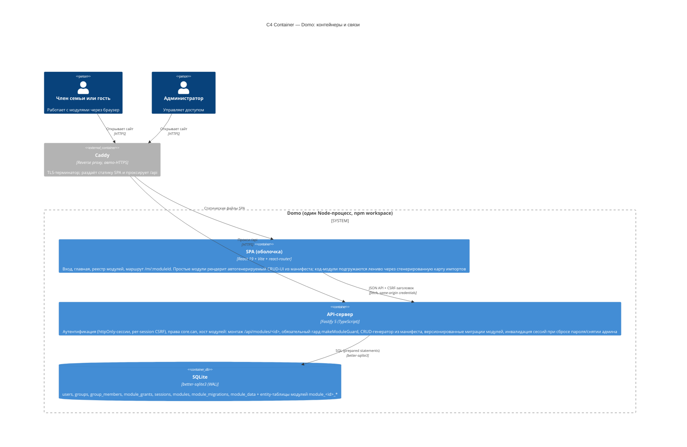

# Архитектура Domo — C4-диаграммы

Два верхних уровня модели C4: **Context** (система и её пользователи) и **Container** (развёртываемые единицы и связи).

Выбранный архитектурный стиль: **модульный монолит** — один Node-процесс, одна SQLite-БД, модули живут внутри процесса с чёткими границами (манифест + хост + обязательная проверка прав).

## Уровень 1: Context

## Уровень 2: Container

## Ключевые решения за диаграммами

- **Один процесс, одна БД.** Для масштаба до ~100 пользователей и одного дома распределённая сложность не нужна. Модули изолируются границами в коде, а не процессами.
- **Хост модулей — единственная точка монтажа.** Модуль не может объявить эндпоинт без `core.can(moduleId, action)`: простые модули получают роуты от генератора, код-модули — только через `ctx.route(action, …)`.
- **Простые модули = только манифест.** Сервер хранит манифест и отдаёт его авторизованному UI; поэтому добавление простого модуля не требует пересборки фронтенда. Эталонный пример — `modules/maintenance/` (один `manifest.json`, без кода).
- **`/me` — источник реестра на фронте:** оболочка строит главную и доступность модулей из ответа, без хардкода.
- **Платформенные контуры** (`/api/auth/*`, `/api/admin/*`) остаются глобальными; admin числится в реестре модулей как код-модуль для единообразного отображения, но маршруты админки платформенные — осознанное исключение.

Полное описание решения (компоненты, API-контракты, модель данных, failure modes, путь миграции) — в `.10x/decisions/architect/module-system.md`.
