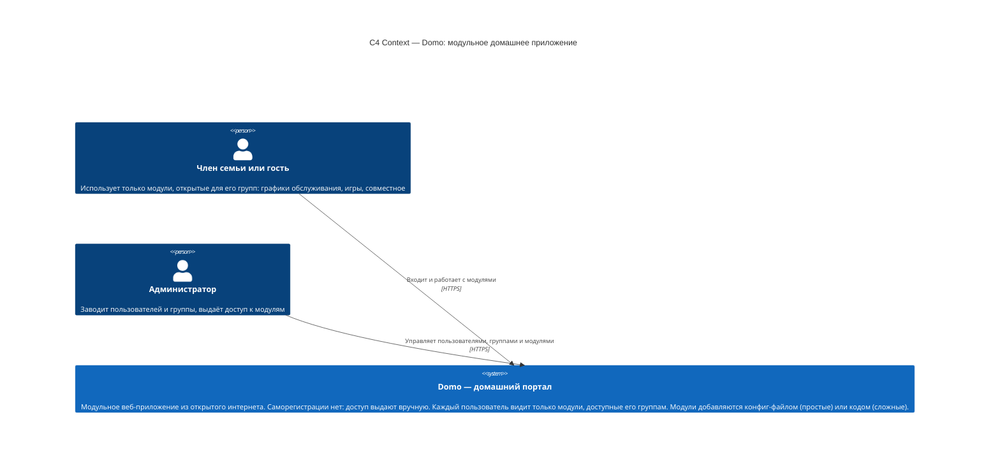

# Архитектура Domo — C4-диаграммы

Два верхних уровня модели C4: **Context** (система и её пользователи) и **Container** (развёртываемые единицы и связи).

Выбранный архитектурный стиль: **модульный монолит** — один Node-процесс, одна SQLite-БД, модули живут внутри процесса с чёткими границами (манифест + хост + обязательная проверка прав).

## Уровень 1: Context



## Уровень 2: Container

```mermaid
C4Container
title C4 Container — Domo: контейнеры и связи

Person(user, "Член семьи или гость", "Работает с модулями через браузер")
Person(admin, "Администратор", "Управляет доступом")

System_Boundary(domo, "Domo (один Node-процесс, npm workspace)") {
  Container(spa, "SPA (оболочка)", "React 19 + Vite + react-router", "Вход, главная, реестр модулей, маршрут /m/:moduleId. Простые модули рендерит автогенерируемый CRUD-UI из манифеста; код-модули подгружаются лениво через сгенерированную карту импортов")
  Container(api, "API-сервер", "Fastify 5 (TypeScript)", "Аутентификация (httpOnly-сессии, per-session CSRF, пинкод и/или пароль на пользователя — вход любым из заданных), права core.can, хост модулей: монтаж /api/modules/<id>, обязательный гард makeModuleGuard, CRUD-генератор из манифеста, версионированные миграции модулей, инвалидация сессий при смене учётных данных/снятии админа. Файловые роуты модулей (загрузка/отдача/удаление) поверх абстракции ByteStorage: S3 (MinIO) в проде, локальный диск в разработке")
  ContainerDb(db, "SQLite", "better-sqlite3 (WAL)", "users, groups, group_members, module_grants, sessions, modules, module_migrations, module_data + entity-таблицы модулей module_<id>_* + files (метаданные файлов модулей: uuid, имя, mime, размер, владелец)")
}

Container_Ext(caddy, "Caddy", "Reverse proxy, авто-HTTPS", "TLS-терминатор; раздаёт статику SPA и проксирует /api")
Container_Ext(minio, "MinIO", "S3-совместимое хранилище", "Байты файлов модулей. Volume minio_data. Console на 127.0.0.1:9001")

Rel(user, caddy, "Открывает сайт", "HTTPS")
Rel(admin, caddy, "Открывает сайт", "HTTPS")
Rel(caddy, spa, "Статические файлы SPA")
Rel(caddy, api, "Прокси /api", "HTTPS")
Rel(spa, api, "JSON API + CSRF-заголовок", "fetch, same-origin credentials")
Rel(api, db, "SQL (prepared statements)", "better-sqlite3")
Rel(api, minio, "S3 put/get/delete объектов", "HTTPS, ключи из S3_*")
Rel_Neighbor(minio, db, "Нет прямой связи", "байты и метаданные разделены")
```

## Развёртывание и CI/CD

- **Прод:** Docker Compose (`docker-compose.yml`) + Caddy (авто-HTTPS) + MinIO (S3-хранилище файлов). Пуш в `main` запускает workflow `Deploy` (`.github/workflows/deploy.yml`) на self-hosted runner: тесты + сборка в контейнере → синхронизация кода в каталог деплоя → `docker compose up -d --wait --build` → healthcheck приложения и Caddy.
- **Staging:** изолированный стенд для проверки изменений перед продом (`docker-compose.staging.yml`, проект `perepelkin-home-staging`, отдельные volume `staging_data` и `staging_minio_data`, порт `3080`, только домашняя сеть). Деплой — workflow `Staging` (вручную или пуш в ветку `staging`).
- **Изоляция окружений:** у стенда свои БД, данные и учётка admin (пароль из `.env` стенда). Прод при деплое стенда не затрагивается. Стенд стартует со свежей БД и автоматическим seed'ом.

## Ключевые решения за диаграммами

- **Один процесс, одна БД.** Для масштаба до ~100 пользователей и одного дома распределённая сложность не нужна. Модули изолируются границами в коде, а не процессами.
- **Хост модулей — единственная точка монтажа.** Модуль не может объявить эндпоинт без `core.can(moduleId, action)`: простые модули получают роуты от генератора, код-модули — только через `ctx.route(action, …)`.
- **Простые модули = только манифест.** Сервер хранит манифест и отдаёт его авторизованному UI; поэтому добавление простого модуля не требует пересборки фронтенда. Эталонный пример — `modules/todo/` (`manifest.json` + опциональный свой интерфейс).
- **`/me` — источник реестра на фронте:** оболочка строит главную и доступность модулей из ответа, без хардкода.
- **Платформенные контуры** (`/api/auth/*`, `/api/admin/*`) остаются глобальными; admin числится в реестре модулей как код-модуль для единообразного отображения, но маршруты админки платформенные — осознанное исключение.
- **Файлы модулей = платформенный механизм.** Загрузка/отдача/удаление файлов — общие роуты под правами модуля (`files.read`/`files.write`), а не код каждого модуля. Байты и метаданные разделены: SQLite хранит `files` (uuid, имя, mime, размер, владелец), хранилище — сырые объекты по ключу `randomUUID()`. Backend-хранилище выбирается конфигом: S3/MinIO (прод и стенды, bucket создаётся при старте) или локальный диск (разработка) — общий интерфейс `ByteStorage` (`apps/server/src/modules/storage.ts`, клиент `minio`). Загружаются только изображения (SVG запрещён), размер ограничен `MAX_FILE_SIZE_MB`; ключи валидируются (защита от path traversal). S3-путь проверяется офлайн мок-сервером (`storage.s3mock.test.ts`) и опциональным интеграционным тестом (`storage.s3.test.ts`, `S3_TEST_ENDPOINT`).
